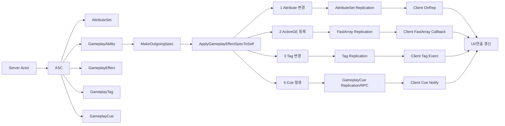

# GAS / Reflection / Replication 동기화 핵심 흐름

이 문서는 GAS가 서버에서 결과를 만들고, Reflection / Replication 시스템을 통해 클라이언트에 동기화되는 큰 흐름을 이미지화하기 위한 기준 문서다.

## 1. 먼저 볼 핵심 흐름과 함수

이 문서의 기준은 아래 4개 동기화 흐름이다.

```txt
1. AttributeSet Replication
 -> Health, Damage 같은 수치 동기화

2. ActiveGameplayEffect FastArray Replication
 -> 버프, 디버프, 쿨다운처럼 적용 중인 GE 동기화

3. GameplayTag Replication
 -> Weapon.Cooldown, Debuff.StickyMud 같은 상태 태그 동기화

4. GameplayCue Replication / RPC
 -> 피격, 둔화, 화상 같은 연출 동기화
```

가장 먼저 볼 호출 흐름:

```txt
[서버 공통 시작]
Ability 또는 게임 로직
 -> ASC::MakeOutgoingSpec() [선행]
 -> AssignTagSetByCallerMagnitude() [선행]
 -> ASC::ApplyGameplayEffectSpecToSelf() [선행] [중요]

[결과 4갈래]
1. Attribute 변경
 -> AttributeSet Replication [동기화]

2. ActiveGE 등록
 -> ActiveGameplayEffect FastArray Replication [동기화]

3. Tag 변경
 -> GameplayTag Replication [동기화]

4. Cue 발생
 -> GameplayCue Replication / RPC [동기화]

[클라이언트]
OnRep / FastArray 콜백 / Tag Event / Cue Notify
 -> UI / 연출 갱신
```

함수 우선순위 표:

| 흐름 | 먼저 볼 함수 | 표시 | 목적 |
|---|---|---|---|
| 공통 시작 | `ASC::ApplyGameplayEffectSpecToSelf()` | `[선행]` `[중요]` | GE 적용의 중심 진입점 |
| Attribute | `ASC::ExecuteGameplayEffect()` | `[신규]` `[중요]` | Instant GE가 Attribute를 실제 변경하는 흐름 |
| Attribute | `AttributeSet::GetLifetimeReplicatedProps()` | `[신규]` `[동기화]` `[중요]` | Attribute 값 복제 등록 |
| Attribute | `OnRep_Health()` + `GAMEPLAYATTRIBUTE_REPNOTIFY()` | `[신규]` `[동기화]` `[중요]` | 클라이언트가 수치 변경을 받은 뒤 GAS 알림 연결 |
| ActiveGE | `FActiveGameplayEffectsContainer::ApplyGameplayEffectSpec()` | `[신규]` `[중요]` | Duration / Infinite GE를 ActiveGE로 등록 |
| ActiveGE | `MarkItemDirty()` | `[신규]` `[동기화]` `[중요]` | FastArray 복제 변경 표시 |
| ActiveGE | `NetDeltaSerialize()` | `[신규]` `[동기화]` | ActiveGE 변경분 복제 |
| Tag | `AddActiveGameplayEffectGrantedTagsAndModifiers()` | `[신규]` `[중요]` | GE Granted Tag를 ASC에 반영 |
| Tag | `ASC::UpdateTagMap()` | `[신규]` `[동기화]` `[중요]` | GameplayTag Count 증가/감소 |
| Cue | `ASC::InvokeGameplayCueEvent()` | `[신규]` `[동기화]` `[중요]` | GameplayCue 이벤트 발생 |
| Cue | `GameplayCueNotify` | `[신규]` `[동기화]` | 클라이언트 연출 실행 |
| ASC 복제 | `ASC::GetLifetimeReplicatedProps()` | `[신규]` `[동기화]` `[중요]` | ASC가 복제할 GAS 데이터 등록 |

표시 의미:

```txt
[선행]
 -> GAS_Code_Analysis_Flow_KR.md에서 이미 큰 역할을 본 함수

[신규]
 -> 기존 분석 파일에 없거나, 동기화 관점에서 새로 볼 함수

[중요]
 -> 그림으로 만들 때 반드시 중심 노드로 들어가야 하는 함수

[동기화]
 -> Reflection / Replication / RPC / OnRep / FastArray와 직접 관련된 함수
```

## 2. Reflection / Replication / GAS 관계

먼저 용어를 구분한다.

```txt
Reflection
 -> UPROPERTY, UFUNCTION, UCLASS 같은 메타데이터 시스템
 -> 엔진에게 이 멤버와 함수가 어떤 의미인지 알려준다.

Replication
 -> 서버 값을 클라이언트에 동기화하는 네트워크 시스템
 -> Reflection 메타데이터를 기반으로 복제할 Property와 RPC를 찾는다.

GAS 동기화
 -> ASC / AttributeSet / ActiveGE / GameplayTag / GameplayCue 결과를 Replication 경로로 전달한다.
```

예:

```cpp
UPROPERTY(ReplicatedUsing = OnRep_Health)
FGameplayAttributeData Health;

UFUNCTION()
void OnRep_Health(const FGameplayAttributeData& OldHealth);
```

의미:

```txt
UPROPERTY
 -> Reflection에 Property 등록

ReplicatedUsing
 -> 이 값은 서버에서 클라이언트로 복제된다.
 -> 클라이언트 수신 후 OnRep_Health()를 호출한다.

UFUNCTION
 -> OnRep 함수를 Reflection에 등록한다.
```

RPC도 Reflection을 사용한다.

```cpp
UFUNCTION(Server, Reliable)
void ServerTryActivateAbility(...);
```

의미:

```txt
클라이언트에서 호출
 -> 서버에서 ServerTryActivateAbility_Implementation() 실행
```

## 3. 이미지화용 전체 구조

Mermaid 기준:



ASCII 구조:

```txt
Server Actor
 └─ ASC
     ├─ AttributeSet
     │   └─ Health / Damage / Range
     │       └─ AttributeSet Replication
     │           └─ OnRep_Health()
     │               └─ UI 갱신
     │
     ├─ ActiveGameplayEffects
     │   └─ Buff / Debuff / Cooldown
     │       └─ FastArray Replication
     │           └─ PostReplicatedAdd/Change/Remove
     │
     ├─ GameplayTagCountContainer
     │   └─ Weapon.Cooldown / Debuff.StickyMud
     │       └─ Tag Replication
     │           └─ Tag Event
     │
     └─ ActiveGameplayCues
         └─ Hit / Slow / Burn 연출
             └─ GameplayCue Replication/RPC
                 └─ GameplayCueNotify
```

## 4. GAS 객체 연결 구조

| 객체 | 역할 | 동기화와 연결되는 지점 |
|---|---|---|
| `Actor` | 월드에 존재하는 대상 | ActorChannel을 통해 복제됨 |
| `ASC` | GAS 중심 컴포넌트 | ActiveGE, Tag, Cue, AbilitySpec 복제 |
| `AttributeSet` | 수치 저장소 | AttributeSet Replication / OnRep |
| `GameplayAbility` | 행동 로직 | GE Spec 생성, GE 적용 흐름 시작 |
| `GameplayEffect` | Attribute / Tag / Cue 변경 규칙 | 적용 결과가 4대 동기화 경로로 갈라짐 |
| `GameplayTag` | 상태 / 조건 / 데이터 키 | Tag Count 복제 |
| `ActiveGameplayEffect` | 적용 중인 GE 인스턴스 | FastArray 복제 |
| `GameplayCue` | 연출 이벤트 | Cue Replication / RPC |

핵심 연결:

```txt
Actor
 -> ASC
     -> AttributeSet
     -> ActiveGameplayEffects
     -> GameplayTagCountContainer
     -> ActiveGameplayCues
```

## 5. 공통 시작 흐름: GE 적용

서버에서 GAS 결과가 만들어지는 공통 시작점이다.

```txt
Ability 또는 게임 로직
 -> MakeOutgoingSpec()
 -> AssignTagSetByCallerMagnitude()
 -> ApplyGameplayEffectSpecToSelf()
```

현재 프로젝트 예:

```txt
UTDFL_Utility::EnemyDamage()
 -> MakeOutgoingSpec(GE_Damage)
 -> AssignTagSetByCallerMagnitude(Damage.SetByCaller, -Damage)
 -> ApplyGameplayEffectSpecToSelf()
```

중요 함수:

### `ASC::ApplyGameplayEffectSpecToSelf()` `[선행]` `[중요]`

```txt
준비된 GameplayEffectSpec을 실제 ASC에 적용하는 중심 함수다.
이 함수 이후 결과가 Attribute / ActiveGE / Tag / Cue 네 갈래로 나뉜다.
```

큰 흐름:

```txt
ApplyGameplayEffectSpecToSelf()
 -> FActiveGameplayEffectsContainer::ApplyGameplayEffectSpec()
 -> Instant GE면 Attribute 변경
 -> Duration / Infinite GE면 ActiveGE 등록
 -> Granted Tag / GameplayCue 처리 가능
```

## 6. 핵심 1: AttributeSet Replication

목적:

```txt
Health, Mana, Damage 같은 수치 값을 서버에서 클라이언트로 동기화한다.
```

서버 호출 흐름:

```txt
ApplyGameplayEffectSpecToSelf()
 -> ExecuteGameplayEffect()
 -> ExecuteActiveEffectsFrom()
 -> InternalExecuteMod()
 -> ApplyModToAttribute()
 -> SetNumericAttribute_Internal()
 -> Attribute 값 변경
```

클라이언트 동기화 흐름:

```txt
AttributeSet Replication
 -> OnRep_Health()
 -> GAMEPLAYATTRIBUTE_REPNOTIFY()
 -> Attribute Delegate / UI 갱신
```

중요 함수:

### `ASC::ExecuteGameplayEffect()` `[신규]` `[중요]`

```txt
Instant GE가 실제 Attribute 변경으로 이어지는 핵심 흐름이다.
예를 들어 GE_Damage가 Health를 100에서 90으로 바꾸는 길목이다.
```

### `AttributeSet::GetLifetimeReplicatedProps()` `[신규]` `[동기화]` `[중요]`

```txt
AttributeSet 안의 어떤 Attribute를 클라이언트에 복제할지 등록한다.
Health를 클라이언트 UI에서 보여주려면 이 경로가 중요하다.
```

예시 코드:

```cpp
void UTDEnemySet::GetLifetimeReplicatedProps(TArray<FLifetimeProperty>& OutLifetimeProps) const
{
    Super::GetLifetimeReplicatedProps(OutLifetimeProps);

    DOREPLIFETIME_CONDITION_NOTIFY(
        UTDEnemySet,
        Health,
        COND_None,
        REPNOTIFY_Always);
}
```

### `OnRep_Health()` + `GAMEPLAYATTRIBUTE_REPNOTIFY()` `[신규]` `[동기화]` `[중요]`

```txt
클라이언트가 서버의 Health 변경을 받은 뒤 호출된다.
GAMEPLAYATTRIBUTE_REPNOTIFY()는 GAS Attribute Delegate / 예측 보정 흐름과 연결된다.
```

예시 코드:

```cpp
void UTDEnemySet::OnRep_Health(const FGameplayAttributeData& OldHealth)
{
    GAMEPLAYATTRIBUTE_REPNOTIFY(UTDEnemySet, Health, OldHealth);
}
```

이미지화 노드:

```txt
GE_Damage
 -> ExecuteGameplayEffect
 -> Health 100 -> 90
 -> AttributeSet Replication
 -> OnRep_Health
 -> UI Health 90
```

## 7. 핵심 2: ActiveGameplayEffect FastArray Replication

목적:

```txt
버프, 디버프, 쿨다운처럼 일정 시간 유지되는 GameplayEffect를 동기화한다.
```

서버 호출 흐름:

```txt
ApplyGameplayEffectSpecToSelf()
 -> FActiveGameplayEffectsContainer::ApplyGameplayEffectSpec()
 -> ActiveGameplayEffects에 FActiveGameplayEffect 추가
 -> MarkItemDirty()
```

클라이언트 동기화 흐름:

```txt
FActiveGameplayEffectsContainer::NetDeltaSerialize()
 -> FActiveGameplayEffect::PostReplicatedAdd()
 -> FActiveGameplayEffect::PostReplicatedChange()
 -> FActiveGameplayEffect::PreReplicatedRemove()
 -> 상태 아이콘 / 쿨다운 UI 갱신
```

중요 함수:

### `FActiveGameplayEffectsContainer::ApplyGameplayEffectSpec()` `[신규]` `[중요]`

```txt
GE가 Instant인지 Duration/Infinite인지에 따라 처리 방향을 나눈다.
Duration / Infinite GE는 ActiveGameplayEffect로 등록된다.
```

### `MarkItemDirty()` `[신규]` `[동기화]` `[중요]`

```txt
FastArray에서 특정 항목이 변경되었음을 복제 시스템에 알린다.
ActiveGE가 추가/변경되었는데 MarkItemDirty가 없다면 변경분 복제가 되지 않는다.
```

### `NetDeltaSerialize()` `[신규]` `[동기화]`

```txt
FastArray가 전체 배열이 아니라 변경된 항목만 네트워크로 보내기 위해 사용하는 직렬화 함수다.
ActiveGameplayEffect, AbilitySpec, GameplayCue 같은 컨테이너에서 중요하다.
```

이미지화 노드:

```txt
GE_Cooldown
 -> ActiveGE 등록
 -> MarkItemDirty
 -> FastArray Replication
 -> Client PostReplicatedAdd
 -> Cooldown UI
```

## 8. 핵심 3: GameplayTag Replication

목적:

```txt
Weapon.Cooldown, Debuff.StickyMud 같은 상태 태그를 동기화한다.
```

서버 호출 흐름:

```txt
GE 적용
 -> AddActiveGameplayEffectGrantedTagsAndModifiers()
 -> UpdateTagMap()
 -> GameplayTagCountContainer 변경
```

클라이언트 동기화 흐름:

```txt
GameplayTagCountContainer / MinimalReplicationTags 복제
 -> RegisterGameplayTagEvent()가 있으면 반응 가능
 -> 상태 아이콘 / 조건 처리 갱신
```

중요 함수:

### `AddActiveGameplayEffectGrantedTagsAndModifiers()` `[신규]` `[중요]`

```txt
ActiveGE가 적용될 때 GE가 부여하는 Granted Tag와 Modifier를 ASC에 반영한다.
```

### `ASC::UpdateTagMap()` `[신규]` `[동기화]` `[중요]`

```txt
ASC가 가진 GameplayTag Count를 증가/감소시킨다.
Weapon.Cooldown, Debuff.StickyMud 같은 상태 태그 변화가 이 함수와 연결된다.
```

예:

```txt
GE_FireWeaponCooldown 적용
 -> Weapon.Cooldown Count +1

GE 제거
 -> Weapon.Cooldown Count -1
```

이미지화 노드:

```txt
GE_FireWeaponCooldown
 -> Granted Tag: Weapon.Cooldown
 -> UpdateTagMap
 -> Tag Replication
 -> Client Tag Event
 -> Cooldown Icon
```

## 9. 핵심 4: GameplayCue Replication / RPC

목적:

```txt
피격, 둔화, 화상 같은 연출 이벤트를 클라이언트에서 실행한다.
```

서버 호출 흐름:

```txt
GE 적용 / 실행 / 제거
 -> InvokeGameplayCueEvent()
 -> ExecuteGameplayCue() / AddGameplayCue() / RemoveGameplayCue()
```

클라이언트 동기화 흐름:

```txt
GameplayCue Replication / RPC
 -> GameplayCueNotify 실행
 -> 이펙트 / 사운드 / 연출 재생
```

중요 함수:

### `ASC::InvokeGameplayCueEvent()` `[신규]` `[동기화]` `[중요]`

```txt
GE 적용, 실행, 제거 시점에 GameplayCue 이벤트를 발생시키는 핵심 함수다.
Attribute 값을 바꾸는 함수는 아니고, 클라이언트 연출을 실행시키는 흐름이다.
```

### `GameplayCueNotify` `[신규]` `[동기화]`

```txt
클라이언트에서 실제 이펙트, 사운드, 연출을 실행하는 객체다.
```

이미지화 노드:

```txt
GE_Damage
 -> GameplayCue.Hit
 -> InvokeGameplayCueEvent
 -> GameplayCue Replication/RPC
 -> Client GameplayCueNotify
 -> Hit Effect
```

## 10. ASC가 복제하는 GAS 데이터

`[신규]` `[동기화]` `[중요]` `UAbilitySystemComponent::GetLifetimeReplicatedProps()`

ASC는 내부 GAS 상태를 Replication에 등록한다.

대표 복제 대상:

```txt
ActiveGameplayEffects
SpawnedAttributes
ActiveGameplayCues
GameplayTagCountContainer
ReplicatedLooseTags
ActivatableAbilities
MinimalReplicationTags
ReplicatedPredictionKeyMap
```

엔진 코드 형태:

```cpp
DOREPLIFETIME_WITH_PARAMS_FAST(UAbilitySystemComponent, ActiveGameplayEffects, Params);
DOREPLIFETIME_WITH_PARAMS_FAST(UAbilitySystemComponent, SpawnedAttributes, Params);
DOREPLIFETIME_WITH_PARAMS_FAST(UAbilitySystemComponent, ActiveGameplayCues, Params);
DOREPLIFETIME_WITH_PARAMS_FAST(UAbilitySystemComponent, GameplayTagCountContainer, Params);
DOREPLIFETIME_WITH_PARAMS_FAST(UAbilitySystemComponent, ActivatableAbilities, Params);
DOREPLIFETIME_WITH_PARAMS_FAST(UAbilitySystemComponent, MinimalReplicationTags, Params);
```

주의:

```txt
ASC 클래스에 복제 대상이 등록되어 있어도,
프로젝트 Actor에서 ASC 컴포넌트 복제가 켜져 있어야 실제로 클라이언트에 간다.
```

프로젝트에서 확인할 코드:

```cpp
AbilitySystemComponent->SetIsReplicated(true);
AbilitySystemComponent->SetReplicationMode(EGameplayEffectReplicationMode::Mixed);
```

## 11. 보조 동기화 기법

처음 분석의 중심은 아니지만, 상황에 따라 중요하다.

| 분류 | 언제 중요한가 | 대표 함수 / 구조 |
|---|---|---|
| AbilitySpec Replication | 클라이언트가 보유 Ability 목록을 알아야 할 때 | `GiveAbility()`, `ActivatableAbilities`, `FGameplayAbilitySpecContainer` |
| PredictionKey Replication / 보정 | 클라이언트 예측 실행을 분석할 때 | `FScopedPredictionWindow`, `FPredictionKey`, `ReplicatedPredictionKeyMap` |
| 일반 Actor / Component Replication | GAS 밖 상태를 동기화할 때 | `DOREPLIFETIME`, `ReplicatedUsing`, `SetIsReplicated()` |
| 직접 RPC | 입력, 실행 요청, TargetData 전달 | `UFUNCTION(Server)`, `UFUNCTION(Client)`, `_Implementation()` |

현재 프로젝트 예:

```txt
일반 Actor Replication
 -> ATDEnemyActor::Distance
 -> ATDEnemyActor::IsDead
 -> ATDTowerBase::UpgradeLevel

직접 RPC
 -> ATDPlayerController::Server_DoTowerAction()
 -> GAS 내부 ServerTryActivateAbility()
```

## 12. 핵심 예시: 타워 데미지 10, 적 체력 100

상황:

```txt
Tower Damage = 10
Enemy Health = 100
Server 1개
Client 3개
```

서버 GAS 실행:

```txt
UTDFL_Utility::EnemyDamage()
 -> MakeOutgoingSpec(GE_Damage)
 -> AssignTagSetByCallerMagnitude(Damage.SetByCaller, -10)
 -> ApplyGameplayEffectSpecToSelf()
 -> ExecuteGameplayEffect()
 -> Health 100 -> 90
```

동기화:

```txt
[Server]
Health 90으로 변경
 -> AttributeSet / ASC 복제 대상 변경

[Client 1]
ActorChannel로 변경 수신
 -> OnRep_Health / FastArray / Cue 중 해당 경로 실행
 -> UI Health 90

[Client 2]
ActorChannel로 변경 수신
 -> OnRep_Health / FastArray / Cue 중 해당 경로 실행
 -> UI Health 90

[Client 3]
ActorChannel로 변경 수신
 -> OnRep_Health / FastArray / Cue 중 해당 경로 실행
 -> UI Health 90
```

서버가 직접 아래처럼 호출하는 것이 아니다.

```txt
Client1.SetHealth(90)
Client2.SetHealth(90)
Client3.SetHealth(90)
```

Replication 시스템이 각 클라이언트 Connection의 ActorChannel을 통해 변경분을 전달한다.

## 13. 현재 프로젝트에서 바로 확인할 것

현재 C++ 기준으로 보이는 상태:

```txt
ATDEnemyActor
 -> bReplicates = true
 -> CurrentPath / Distance / IsDead 복제 있음

UTDEnemySet
 -> Health ReplicatedUsing 없음
 -> OnRep_Health 없음
 -> GetLifetimeReplicatedProps 없음

UTDTowerSet
 -> Attribute ReplicatedUsing 없음
 -> GetLifetimeReplicatedProps 없음

ASC
 -> SetIsReplicated(true) 확인 안 됨
 -> SetReplicationMode(...) 확인 안 됨
```

따라서 먼저 볼 것:

```txt
1. ASC 복제 설정이 있는가?
2. AttributeSet Health 복제가 있는가?
3. GE_Damage 적용 후 서버 Health가 90이 되는가?
4. Client 1/2/3도 Health 90을 받는가?
5. 받는다면 4대 핵심 경로 중 어느 경로인가?
   - AttributeSet Replication
   - ActiveGameplayEffect FastArray Replication
   - GameplayTag Replication
   - GameplayCue Replication / RPC
```

## 14. 최종 이미지화 기준

이미지를 만든다면 아래 레이어로 나누면 된다.

```txt
Layer 1. GAS 객체 구조
Actor -> ASC -> AttributeSet / ActiveGE / Tag / Cue

Layer 2. 서버 실행 흐름
게임 로직 또는 Ability -> GE Spec -> GE 적용

Layer 3. 4대 핵심 결과
Attribute / ActiveGE / Tag / Cue

Layer 4. 4대 동기화 경로
AttributeSet Replication
ActiveGameplayEffect FastArray Replication
GameplayTag Replication
GameplayCue Replication / RPC

Layer 5. 클라이언트 결과
OnRep / FastArray Callback / Tag Event / Cue Notify
 -> UI / 연출 갱신
```

이미지의 중심 문장:

```txt
GAS는 서버에서 GE를 적용해 Attribute / ActiveGE / Tag / Cue 결과를 만들고,
Reflection으로 등록된 Replication 경로를 통해
각 클라이언트의 ASC / AttributeSet 사본에 결과를 전달한다.
```
