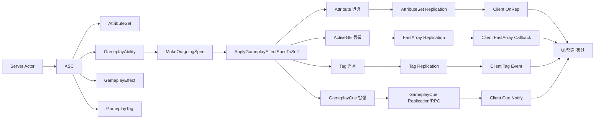

# GAS / Reflection / Replication 동기화 큰 흐름

이 문서는 GAS가 값을 만들고, Unreal Reflection / Replication 시스템을 통해 클라이언트에 동기화되는 큰 흐름을 이미지화하기 위한 기준 문서다.

먼저 용어를 구분한다.

```txt
Reflection
 -> UPROPERTY, UFUNCTION, UCLASS 같은 메타데이터 시스템
 -> 어떤 함수/멤버가 엔진에 노출되는지 알려준다.

Replication
 -> 서버 값을 클라이언트에 동기화하는 네트워크 시스템
 -> Reflection 메타데이터를 기반으로 복제할 Property / RPC를 찾는다.

GAS 동기화
 -> ASC / AttributeSet / ActiveGE / Tag / Cue 결과를 Replication 경로로 전달한다.
```

## 1. 먼저 볼 전체 흐름

아래 순서가 이 문서의 핵심이다.

```txt
[1] GAS 객체 준비
Actor
 -> ASC
 -> AttributeSet
 -> Ability
 -> GameplayEffect
 -> GameplayTag

[2] 서버에서 GAS 실행
Ability 또는 게임 로직
 -> GE Spec 생성
 -> GE 적용
 -> Attribute / ActiveGE / Tag / Cue 결과 생성

[3] Reflection / Replication이 동기화
UPROPERTY / UFUNCTION 메타데이터
 -> ASC / AttributeSet 복제 대상 확인
 -> ActorChannel로 각 클라이언트에 전송

[4] 클라이언트에서 결과 반영
OnRep
 -> FastArray 콜백
 -> GameplayCue 실행
 -> UI / 연출 갱신
```

가장 큰 서버/클라이언트 흐름은 이것이다.

```txt
[서버]
GE 적용
 -> Attribute 변경
 -> ActiveGE 등록
 -> Tag 변경
 -> Cue 발생
 -> ASC / AttributeSet 복제 대상 변경

[클라이언트]
ActorChannel을 통해 ASC / AttributeSet 변경 수신
 -> OnRep / FastArray 콜백 / GameplayCue 실행
 -> UI / 연출 갱신
```

## 2. 이미지화용 전체 도식

Mermaid로 옮기기 좋은 형태:



ASCII로 보면:

```txt
Server Actor
 └─ ASC
     ├─ AttributeSet
     │   └─ Health / Damage / Range
     ├─ GameplayAbility
     │   └─ 실행 로직
     ├─ GameplayEffect
     │   └─ Attribute / Tag 변경 규칙
     └─ GameplayTag
         └─ 상태 / 조건 / SetByCaller 키

GE 적용 결과
 ├─ Attribute 변경 ───────> AttributeSet OnRep ───────> Client UI
 ├─ ActiveGE 등록 ────────> FastArray 복제 ───────────> Client 상태 표시
 ├─ Tag 변경 ─────────────> Tag Count 복제/Event ─────> Client 아이콘/조건
 └─ GameplayCue 발생 ─────> Cue Notify 실행 ──────────> Client 이펙트/사운드
```

## 3. 가장 먼저 볼 함수표

`[선행]`은 `GAS_Code_Analysis_Flow_KR.md`에서 이미 큰 역할을 본 함수다.  
`[신규]`는 해당 파일에 없거나, 동기화 관점에서 새로 봐야 하는 함수다.  
`[동기화]`는 Reflection / Replication과 직접 관련된 함수다.

| 순서 | 함수 / 코드 | 표시 | 왜 보는가 |
|---|---|---|---|
| 1 | `ASC::InitAbilityActorInfo()` | `[선행]` | ASC가 Owner / Avatar를 알게 되는 시작점 |
| 2 | `ASC::GiveAbility()` | `[선행]` | AbilitySpec을 ASC에 등록 |
| 3 | `ASC::MakeOutgoingSpec()` | `[선행]` | GE 적용용 런타임 Spec 생성 |
| 4 | `AssignTagSetByCallerMagnitude()` | `[선행]` | Spec에 `Damage.SetByCaller = -10` 같은 값 주입 |
| 5 | `ASC::ApplyGameplayEffectSpecToSelf()` | `[선행]` `[중요]` | GE 적용의 중심 진입점 |
| 6 | `FActiveGameplayEffectsContainer::ApplyGameplayEffectSpec()` | `[신규]` `[중요]` | Instant / Duration / Infinite GE 처리 분기 |
| 7 | `ASC::ExecuteGameplayEffect()` | `[신규]` `[중요]` | Instant GE가 Attribute를 실제 변경하는 흐름 |
| 8 | `FActiveGameplayEffectsContainer::ApplyModToAttribute()` | `[신규]` | Modifier 결과를 Attribute에 반영 |
| 9 | `ASC::SetNumericAttribute_Internal()` | `[신규]` | 최종 Attribute 값 쓰기 |
| 10 | `FActiveGameplayEffectsContainer::MarkItemDirty()` | `[신규]` `[동기화]` | ActiveGE FastArray 복제 변경 표시 |
| 11 | `ASC::UpdateTagMap()` | `[신규]` `[동기화]` | GameplayTag Count 변경 |
| 12 | `ASC::InvokeGameplayCueEvent()` | `[신규]` `[동기화]` | GameplayCue 실행/전달 |
| 13 | `ASC::GetLifetimeReplicatedProps()` | `[신규]` `[동기화]` `[중요]` | ASC가 복제할 GAS 데이터를 등록 |
| 14 | `AttributeSet::GetLifetimeReplicatedProps()` | `[신규]` `[동기화]` `[중요]` | Attribute 값 복제 등록 |
| 15 | `OnRep_Health()` + `GAMEPLAYATTRIBUTE_REPNOTIFY()` | `[신규]` `[동기화]` `[중요]` | 클라이언트 Attribute 수신 후 GAS 알림 연결 |
| 16 | `FActiveGameplayEffectsContainer::NetDeltaSerialize()` | `[신규]` `[동기화]` | ActiveGE FastArray 복제 |

## 4. GAS 객체 연결 구조

| 객체 | 역할 | 연결 대상 |
|---|---|---|
| `Actor` | 월드에 존재하는 대상 | `ASC`, Mesh, Collision |
| `ASC` | GAS 중심 컴포넌트 | `AttributeSet`, `AbilitySpec`, `ActiveGE`, `Tag`, `Cue` |
| `AttributeSet` | 수치 저장소 | `Health`, `Damage`, `Range` |
| `GameplayAbility` | 행동 로직 | 공격, 스킬, 발사 |
| `GameplayEffect` | 값/태그 변경 규칙 | Attribute Modifier, Granted Tag, GameplayCue |
| `GameplayTag` | 상태/조건/데이터 키 | `Damage.SetByCaller`, `Weapon.Cooldown` |
| `ActiveGameplayEffect` | 적용 중인 GE 인스턴스 | Duration / Infinite GE |
| `GameplayCue` | 연출 이벤트 | 이펙트, 사운드, 피격 연출 |

핵심 연결:

```txt
Actor
 -> ASC
     -> AttributeSet
     -> ActivatableAbilities
     -> ActiveGameplayEffects
     -> GameplayTagCountContainer
     -> ActiveGameplayCues
```

## 5. Reflection / Replication 연결 구조

Reflection은 동기화 자체가 아니라, 동기화가 가능하게 엔진에 정보를 알려주는 기반이다.

```cpp
UPROPERTY(ReplicatedUsing = OnRep_Health)
FGameplayAttributeData Health;

UFUNCTION()
void OnRep_Health(const FGameplayAttributeData& OldHealth);
```

위 코드에서:

```txt
UPROPERTY
 -> Reflection에 Property 등록

ReplicatedUsing
 -> Replication 대상임을 표시
 -> 클라이언트 수신 후 호출할 OnRep 함수 지정

UFUNCTION
 -> OnRep 함수를 Reflection에 등록
```

RPC도 Reflection을 사용한다.

```cpp
UFUNCTION(Server, Reliable)
void ServerTryActivateAbility(...);
```

의미:

```txt
UFUNCTION(Server)
 -> 이 함수는 클라이언트에서 호출하면 서버에서 실행되는 RPC다.

_Implementation()
 -> 실제 서버에서 실행되는 구현 함수다.
```

## 6. GE 적용 후 동기화 갈래

GE가 적용되면 결과가 네 갈래로 나뉜다.

```txt
GE 적용
 ├─ Attribute 변경
 ├─ ActiveGE 등록
 ├─ Tag 변경
 └─ Cue 발생
```

### 6.1 Attribute 변경

서버 함수 흐름:

```txt
ApplyGameplayEffectSpecToSelf()
 -> ExecuteGameplayEffect()
 -> ExecuteActiveEffectsFrom()
 -> InternalExecuteMod()
 -> ApplyModToAttribute()
 -> SetNumericAttribute_Internal()
```

클라이언트 동기화:

```txt
AttributeSet Replication
 -> OnRep_Health()
 -> GAMEPLAYATTRIBUTE_REPNOTIFY()
 -> UI 갱신
```

`[신규]` `[중요]` `OnRep_Health()`:

```txt
서버에서 바뀐 Attribute 값을 클라이언트가 받은 뒤 실행되는 함수다.
GAS Attribute Delegate와 예측 보정을 연결하려면 GAMEPLAYATTRIBUTE_REPNOTIFY()가 필요하다.
```

### 6.2 ActiveGE 등록

서버 함수 흐름:

```txt
ApplyGameplayEffectSpec()
 -> ActiveGameplayEffects에 FActiveGameplayEffect 추가
 -> MarkItemDirty()
```

클라이언트 동기화:

```txt
FActiveGameplayEffectsContainer::NetDeltaSerialize()
 -> FActiveGameplayEffect::PostReplicatedAdd()
 -> 클라이언트 상태 갱신
```

`[신규]` `[동기화]` `NetDeltaSerialize()`:

```txt
FastArray가 변경된 항목만 네트워크로 보내기 위해 사용하는 직렬화 함수다.
ActiveGameplayEffect, AbilitySpec, GameplayCue 같은 GAS 컨테이너에서 중요하다.
```

### 6.3 Tag 변경

서버 함수 흐름:

```txt
AddActiveGameplayEffectGrantedTagsAndModifiers()
 -> UpdateTagMap()
 -> GameplayTagCountContainer 변경
```

클라이언트 동기화:

```txt
GameplayTagCountContainer / MinimalReplicationTags 복제
 -> RegisterGameplayTagEvent()가 있으면 클라이언트에서 반응 가능
```

`[신규]` `[동기화]` `UpdateTagMap()`:

```txt
ASC가 가진 GameplayTag Count를 증가/감소시키는 함수다.
Weapon.Cooldown, Debuff.StickyMud 같은 상태 태그 변화가 이 흐름과 연결된다.
```

### 6.4 GameplayCue 발생

서버 함수 흐름:

```txt
InvokeGameplayCueEvent()
ExecuteGameplayCue()
AddGameplayCue()
RemoveGameplayCue()
```

클라이언트 동기화:

```txt
GameplayCue 복제/RPC
 -> GameplayCueNotify 실행
 -> 이펙트 / 사운드 / 연출 재생
```

`[신규]` `[동기화]` `InvokeGameplayCueEvent()`:

```txt
GE 적용, 실행, 제거 시점에 GameplayCue 이벤트를 발생시키는 핵심 함수다.
Attribute 값을 바꾸는 함수는 아니고, 클라이언트 연출을 실행시키는 쪽에 가깝다.
```

## 7. ASC가 복제하는 GAS 데이터

`[신규]` `[동기화]` `[중요]` `UAbilitySystemComponent::GetLifetimeReplicatedProps()`

ASC는 내부 GAS 상태를 Replication에 등록한다.

대표 복제 대상:

```txt
ActiveGameplayEffects
SpawnedAttributes
ActiveGameplayCues
GameplayTagCountContainer
ReplicatedLooseTags
ActivatableAbilities
MinimalReplicationTags
ReplicatedPredictionKeyMap
```

엔진 코드 형태:

```cpp
DOREPLIFETIME_WITH_PARAMS_FAST(UAbilitySystemComponent, ActiveGameplayEffects, Params);
DOREPLIFETIME_WITH_PARAMS_FAST(UAbilitySystemComponent, SpawnedAttributes, Params);
DOREPLIFETIME_WITH_PARAMS_FAST(UAbilitySystemComponent, ActiveGameplayCues, Params);
DOREPLIFETIME_WITH_PARAMS_FAST(UAbilitySystemComponent, GameplayTagCountContainer, Params);
DOREPLIFETIME_WITH_PARAMS_FAST(UAbilitySystemComponent, ActivatableAbilities, Params);
DOREPLIFETIME_WITH_PARAMS_FAST(UAbilitySystemComponent, MinimalReplicationTags, Params);
```

주의:

```txt
ASC 클래스에 복제 대상이 등록되어 있어도,
프로젝트 Actor에서 ASC 컴포넌트 복제가 켜져 있어야 실제로 클라이언트에 간다.
```

프로젝트에서 확인할 코드:

```cpp
AbilitySystemComponent->SetIsReplicated(true);
AbilitySystemComponent->SetReplicationMode(EGameplayEffectReplicationMode::Mixed);
```

## 8. AttributeSet 복제 코드

`[신규]` `[동기화]` `[중요]` `AttributeSet::GetLifetimeReplicatedProps()`

Attribute 값을 클라이언트가 받아야 한다면 AttributeSet에 복제 코드가 있어야 한다.

```cpp
UPROPERTY(ReplicatedUsing = OnRep_Health)
FGameplayAttributeData Health;

UFUNCTION()
void OnRep_Health(const FGameplayAttributeData& OldHealth);
```

```cpp
void UTDEnemySet::GetLifetimeReplicatedProps(TArray<FLifetimeProperty>& OutLifetimeProps) const
{
    Super::GetLifetimeReplicatedProps(OutLifetimeProps);

    DOREPLIFETIME_CONDITION_NOTIFY(
        UTDEnemySet,
        Health,
        COND_None,
        REPNOTIFY_Always);
}
```

```cpp
void UTDEnemySet::OnRep_Health(const FGameplayAttributeData& OldHealth)
{
    GAMEPLAYATTRIBUTE_REPNOTIFY(UTDEnemySet, Health, OldHealth);
}
```

의미:

```txt
서버 Health 변경
 -> Replication이 클라이언트 AttributeSet에 값 전달
 -> OnRep_Health()
 -> GAMEPLAYATTRIBUTE_REPNOTIFY()
 -> 클라이언트 UI / Delegate 갱신 가능
```

## 9. 핵심 예시: 타워 데미지 10, 적 체력 100

```txt
[서버]
Tower Damage = 10
Enemy Health = 100
```

GAS 실행 흐름:

```txt
UTDFL_Utility::EnemyDamage()
 -> MakeOutgoingSpec(GE_Damage)
 -> AssignTagSetByCallerMagnitude(Damage.SetByCaller, -10)
 -> ApplyGameplayEffectSpecToSelf()
 -> ExecuteGameplayEffect()
 -> Health 100 -> 90
```

동기화 흐름:

```txt
[서버]
Health 90으로 변경
 -> AttributeSet / ASC 복제 대상 변경

[Client 1]
ActorChannel로 변경 수신
 -> OnRep_Health / FastArray / Cue 중 해당 경로 실행
 -> UI Health 90

[Client 2]
ActorChannel로 변경 수신
 -> OnRep_Health / FastArray / Cue 중 해당 경로 실행
 -> UI Health 90

[Client 3]
ActorChannel로 변경 수신
 -> OnRep_Health / FastArray / Cue 중 해당 경로 실행
 -> UI Health 90
```

서버가 직접 아래처럼 호출하는 것이 아니다.

```txt
Client1.SetHealth(90)
Client2.SetHealth(90)
Client3.SetHealth(90)
```

Replication 시스템이 각 클라이언트 Connection의 ActorChannel을 통해 변경분을 전달한다.

## 10. 현재 프로젝트에서 바로 확인할 것

현재 C++ 기준으로 보이는 상태:

```txt
ATDEnemyActor
 -> bReplicates = true
 -> CurrentPath / Distance / IsDead 복제 있음

UTDEnemySet
 -> Health ReplicatedUsing 없음
 -> OnRep_Health 없음
 -> GetLifetimeReplicatedProps 없음

UTDTowerSet
 -> Attribute ReplicatedUsing 없음
 -> GetLifetimeReplicatedProps 없음

ASC
 -> SetIsReplicated(true) 확인 안 됨
 -> SetReplicationMode(...) 확인 안 됨
```

따라서 먼저 볼 것:

```txt
1. ASC 복제 설정이 있는가?
2. AttributeSet Health 복제가 있는가?
3. GE_Damage 적용 후 서버 Health가 90이 되는가?
4. Client 1/2/3도 Health 90을 받는가?
5. 받는다면 OnRep / FastArray / Cue 중 어느 경로인가?
```

## 11. 최종 이미지화 기준

이미지를 만든다면 아래 레이어로 나누면 된다.

```txt
Layer 1. GAS 객체 구조
Actor -> ASC -> AttributeSet / Ability / GE / Tag / Cue

Layer 2. 서버 실행 흐름
Ability 또는 게임 로직 -> GE Spec -> GE 적용 -> 결과 생성

Layer 3. 결과 갈래
Attribute / ActiveGE / Tag / Cue

Layer 4. 동기화 경로
OnRep / FastArray / Tag Replication / GameplayCue

Layer 5. 클라이언트 결과
UI / 연출 / 상태 표시
```

이미지의 중심 문장:

```txt
GAS는 서버에서 결과를 만들고,
Reflection으로 등록된 Replication 경로를 통해
각 클라이언트의 ASC / AttributeSet 사본에 결과를 전달한다.
```
