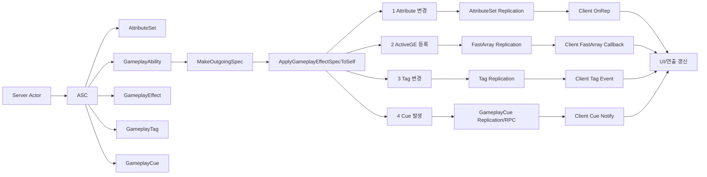

# GAS / Reflection / Replication 동기화 핵심 흐름

이 문서는 GAS가 서버에서 결과를 만들고, Reflection / Replication 시스템을 통해 클라이언트에 동기화되는 큰 흐름을 이미지화하기 위한 기준 문서다.

## 1. 먼저 볼 핵심 흐름과 함수

이 문서의 기준은 아래 4개 동기화 흐름이다.

```txt
1. AttributeSet Replication
 -> Health, Damage 같은 수치 동기화

2. ActiveGameplayEffect FastArray Replication
 -> 버프, 디버프, 쿨다운처럼 적용 중인 GE 동기화

3. GameplayTag Replication
 -> Weapon.Cooldown, Debuff.StickyMud 같은 상태 태그 동기화

4. GameplayCue Replication / RPC
 -> 피격, 둔화, 화상 같은 연출 동기화
```

가장 먼저 볼 호출 흐름:

```txt
[서버 공통 시작]
Ability 또는 게임 로직
 -> ASC::MakeOutgoingSpec() [선행] // 적용할 GE Spec 생성
 -> AssignTagSetByCallerMagnitude() [선행] // Spec에 런타임 수치값 주입
 -> ASC::ApplyGameplayEffectSpecToSelf() [선행] [중요] // GE Spec을 실제 ASC에 적용

[결과 4갈래]
1. Attribute 변경
 -> AttributeSet Replication [동기화] // Health 같은 수치가 클라이언트로 복제

2. ActiveGE 등록
 -> ActiveGameplayEffect FastArray Replication [동기화] // 버프/쿨다운 같은 적용 중 GE가 변경분 복제

3. Tag 변경
 -> GameplayTag Replication [동기화] // 상태 태그 Count가 클라이언트 ASC에 반영

4. Cue 발생
 -> GameplayCue Replication / RPC [동기화] // 피격/화상 같은 연출 이벤트가 전달

[클라이언트]
OnRep / FastArray 콜백 / Tag Event / Cue Notify
 -> UI / 연출 갱신 // 수신된 GAS 결과를 화면과 이펙트에 반영
```

함수 우선순위 표:

| 흐름 | 먼저 볼 함수 | 표시 | 목적 |
|---|---|---|---|
| 공통 시작 | `ASC::ApplyGameplayEffectSpecToSelf()` | `[선행]` `[중요]` | GE 적용의 중심 진입점 |
| Attribute | `ASC::ExecuteGameplayEffect()` | `[신규]` `[중요]` | Instant GE가 Attribute를 실제 변경하는 흐름 |
| Attribute | `AttributeSet::GetLifetimeReplicatedProps()` | `[신규]` `[동기화]` `[중요]` | Attribute 값 복제 등록 |
| Attribute | `OnRep_Health()` + `GAMEPLAYATTRIBUTE_REPNOTIFY()` | `[신규]` `[동기화]` `[중요]` | 클라이언트가 수치 변경을 받은 뒤 GAS 알림 연결 |
| ActiveGE | `FActiveGameplayEffectsContainer::ApplyGameplayEffectSpec()` | `[신규]` `[중요]` | Duration / Infinite GE를 ActiveGE로 등록 |
| ActiveGE | `MarkItemDirty()` | `[신규]` `[동기화]` `[중요]` | FastArray 복제 변경 표시 |
| ActiveGE | `NetDeltaSerialize()` | `[신규]` `[동기화]` | ActiveGE 변경분 복제 |
| Tag | `AddActiveGameplayEffectGrantedTagsAndModifiers()` | `[신규]` `[중요]` | GE Granted Tag를 ASC에 반영 |
| Tag | `ASC::UpdateTagMap()` | `[신규]` `[동기화]` `[중요]` | GameplayTag Count 증가/감소 |
| Cue | `ASC::InvokeGameplayCueEvent()` | `[신규]` `[동기화]` `[중요]` | GameplayCue 이벤트 발생 |
| Cue | `GameplayCueNotify` | `[신규]` `[동기화]` | 클라이언트 연출 실행 |
| ASC 복제 | `ASC::GetLifetimeReplicatedProps()` | `[신규]` `[동기화]` `[중요]` | ASC가 복제할 GAS 데이터 등록 |
| ASC 복제 | `DOREPLIFETIME_WITH_PARAMS_FAST()` | `[신규]` `[동기화]` `[중요]` | Reflection에 등록된 UPROPERTY를 Replication 목록에 등록 |

표시 의미:

```txt
[선행]
 -> GAS_Code_Analysis_Flow_KR.md에서 이미 큰 역할을 본 함수

[신규]
 -> 기존 분석 파일에 없거나, 동기화 관점에서 새로 볼 함수

[중요]
 -> 그림으로 만들 때 반드시 중심 노드로 들어가야 하는 함수

[동기화]
 -> Reflection / Replication / RPC / OnRep / FastArray와 직접 관련된 함수
```

### 예시 코드 함수 / Define 빠른 설명

예시 코드에 나오는 함수와 define은 아래처럼 먼저 잡고 보면 된다.

Reflection / Replication 관련:

| 이름 | 간단 설명 |
|---|---|
| `UPROPERTY(...)` | 멤버 변수를 Unreal Reflection 시스템에 등록한다. `ReplicatedUsing` 같은 복제 설정도 여기에 붙는다. |
| `UFUNCTION(...)` | 함수를 Unreal Reflection 시스템에 등록한다. RPC, OnRep 함수는 이 등록이 필요하다. |
| `ReplicatedUsing = OnRep_Health` | 값이 서버에서 클라이언트로 복제된 뒤 `OnRep_Health()`를 호출하라는 설정이다. |
| `UFUNCTION(Server, Reliable)` | 클라이언트에서 호출하면 서버의 `_Implementation()`이 실행되는 RPC 설정이다. |
| `DOREPLIFETIME_CONDITION_NOTIFY()` | AttributeSet의 특정 Property를 복제 목록에 등록하고 RepNotify 호출 조건을 지정한다. |
| `DOREPLIFETIME_WITH_PARAMS_FAST()` | ASC 내부 Property를 Replication 목록에 등록한다. `_FAST` 버전은 NetField 인덱스 기반으로 빠르게 등록한다. |
| `GAMEPLAYATTRIBUTE_REPNOTIFY()` | OnRep로 받은 Attribute 변경을 GAS의 Attribute Delegate / Aggregator 흐름에 연결한다. |

GAS 실행 관련:

| 이름 | 간단 설명 |
|---|---|
| `ASC::MakeOutgoingSpec()` | GameplayEffectClass, Level, Context로 적용 준비가 끝난 `FGameplayEffectSpec`을 만든다. |
| `AssignTagSetByCallerMagnitude()` | Spec 안에 태그 기반 런타임 값을 넣는다. 예: `Damage.SetByCaller = -10`. |
| `ASC::ApplyGameplayEffectSpecToSelf()` | 만들어진 GE Spec을 자신의 ASC에 적용하는 중심 진입점이다. |
| `ASC::ExecuteGameplayEffect()` | Instant GE가 실제 Attribute 값을 바꾸는 실행 경로다. |
| `FActiveGameplayEffectsContainer::ApplyGameplayEffectSpec()` | Duration / Infinite GE를 ActiveGE로 등록하거나 Instant GE 실행 경로로 보낸다. |

동기화 결과 관련:

| 이름 | 간단 설명 |
|---|---|
| `MarkItemDirty()` | FastArray 항목이 바뀌었음을 복제 시스템에 표시한다. ActiveGE 변경분 복제의 핵심이다. |
| `NetDeltaSerialize()` | FastArray 전체가 아니라 변경된 항목만 직렬화해서 보내는 함수다. |
| `PostReplicatedAdd()` | 클라이언트에서 FastArray 항목이 새로 복제되어 추가됐을 때 호출된다. |
| `PostReplicatedChange()` | 클라이언트에서 FastArray 항목이 변경 복제됐을 때 호출된다. |
| `PreReplicatedRemove()` | 클라이언트에서 FastArray 항목이 제거되기 직전에 호출된다. |
| `ASC::UpdateTagMap()` | GameplayTag Count를 증가/감소시켜 현재 보유 태그 상태를 갱신한다. |
| `ASC::InvokeGameplayCueEvent()` | GE 적용/실행/제거 시점에 GameplayCue 이벤트를 발생시킨다. |
| `SetIsReplicated(true)` | 컴포넌트 자체가 네트워크 복제 대상이 되도록 켠다. ASC 복제의 전제 조건이다. |
| `SetReplicationMode(...)` | ASC가 ActiveGE / Tag / Cue 정보를 어느 범위까지 복제할지 정책을 정한다. |

## 2. Reflection / Replication / GAS 관계

먼저 용어를 구분한다.

```txt
Reflection
 -> UPROPERTY, UFUNCTION, UCLASS 같은 메타데이터 시스템
 -> 엔진에게 이 멤버와 함수가 어떤 의미인지 알려준다.

Replication
 -> 서버 값을 클라이언트에 동기화하는 네트워크 시스템
 -> Reflection 메타데이터를 기반으로 복제할 Property와 RPC를 찾는다.

GAS 동기화
 -> ASC / AttributeSet / ActiveGE / GameplayTag / GameplayCue 결과를 Replication 경로로 전달한다.
```

예:

```cpp
// Health를 복제 대상 Property로 등록하고,
// 클라이언트가 값을 받으면 OnRep_Health()를 호출하게 한다.
UPROPERTY(ReplicatedUsing = OnRep_Health)
FGameplayAttributeData Health;

// OnRep_Health()를 Reflection에 등록한다.
UFUNCTION()
void OnRep_Health(const FGameplayAttributeData& OldHealth);
```

의미:

```txt
UPROPERTY
 -> Reflection에 Property 등록

ReplicatedUsing
 -> 이 값은 서버에서 클라이언트로 복제된다.
 -> 클라이언트 수신 후 OnRep_Health()를 호출한다.

UFUNCTION
 -> OnRep 함수를 Reflection에 등록한다.
```

RPC도 Reflection을 사용한다.

```cpp
// 클라이언트에서 호출하면 서버의 ServerTryActivateAbility_Implementation()이 실행된다.
UFUNCTION(Server, Reliable)
void ServerTryActivateAbility(...);
```

의미:

```txt
클라이언트에서 호출
 -> 서버에서 ServerTryActivateAbility_Implementation() 실행
```

## 3. 이미지화용 전체 구조

Mermaid 기준:



ASCII 구조:

```txt
Server Actor
 └─ ASC
     ├─ AttributeSet
     │   └─ Health / Damage / Range
     │       └─ AttributeSet Replication
     │           └─ OnRep_Health()
     │               └─ UI 갱신
     │
     ├─ ActiveGameplayEffects
     │   └─ Buff / Debuff / Cooldown
     │       └─ FastArray Replication
     │           └─ PostReplicatedAdd/Change/Remove
     │
     ├─ GameplayTagCountContainer
     │   └─ Weapon.Cooldown / Debuff.StickyMud
     │       └─ Tag Replication
     │           └─ Tag Event
     │
     └─ ActiveGameplayCues
         └─ Hit / Slow / Burn 연출
             └─ GameplayCue Replication/RPC
                 └─ GameplayCueNotify
```

## 4. GAS 객체 연결 구조

| 객체 | 역할 | 동기화와 연결되는 지점 |
|---|---|---|
| `Actor` | 월드에 존재하는 대상 | ActorChannel을 통해 복제됨 |
| `ASC` | GAS 중심 컴포넌트 | ActiveGE, Tag, Cue, AbilitySpec 복제 |
| `AttributeSet` | 수치 저장소 | AttributeSet Replication / OnRep |
| `GameplayAbility` | 행동 로직 | GE Spec 생성, GE 적용 흐름 시작 |
| `GameplayEffect` | Attribute / Tag / Cue 변경 규칙 | 적용 결과가 4대 동기화 경로로 갈라짐 |
| `GameplayTag` | 상태 / 조건 / 데이터 키 | Tag Count 복제 |
| `ActiveGameplayEffect` | 적용 중인 GE 인스턴스 | FastArray 복제 |
| `GameplayCue` | 연출 이벤트 | Cue Replication / RPC |

핵심 연결:

```txt
Actor
 -> ASC
     -> AttributeSet
     -> ActiveGameplayEffects
     -> GameplayTagCountContainer
     -> ActiveGameplayCues
```

## 5. 공통 시작 흐름: GE 적용

서버에서 GAS 결과가 만들어지는 공통 시작점이다.

```txt
Ability 또는 게임 로직
 -> MakeOutgoingSpec() // GameplayEffectClass와 Context로 적용할 GE Spec 생성
 -> AssignTagSetByCallerMagnitude() // Spec 안에 런타임 수치값 주입
 -> ApplyGameplayEffectSpecToSelf() // 완성된 Spec을 대상 ASC에 실제 적용
```

현재 프로젝트 예:

```txt
UTDFL_Utility::EnemyDamage()
 -> MakeOutgoingSpec(GE_Damage) // 데미지용 GameplayEffect Spec 생성
 -> AssignTagSetByCallerMagnitude(Damage.SetByCaller, -Damage) // Damage 태그에 실제 데미지 값 주입
 -> ApplyGameplayEffectSpecToSelf() // 적 ASC 자기 자신에게 GE 적용
```

중요 함수:

### `ASC::ApplyGameplayEffectSpecToSelf()` `[선행]` `[중요]`

```txt
준비된 GameplayEffectSpec을 실제 ASC에 적용하는 중심 함수다.
이 함수 이후 결과가 Attribute / ActiveGE / Tag / Cue 네 갈래로 나뉜다.
```

큰 흐름:

```txt
ApplyGameplayEffectSpecToSelf() // GE Spec 적용의 ASC 진입점
 -> FActiveGameplayEffectsContainer::ApplyGameplayEffectSpec() // GE 종류에 따라 Instant / Duration / Infinite 처리 분기
 -> Instant GE면 Attribute 변경 // 즉시 수치 변경 실행
 -> Duration / Infinite GE면 ActiveGE 등록 // 지속 효과 인스턴스를 컨테이너에 저장
 -> Granted Tag / GameplayCue 처리 가능 // 태그 상태와 연출 이벤트도 함께 처리될 수 있음
```

## 6. 핵심 1: AttributeSet Replication

목적:

```txt
Health, Mana, Damage 같은 수치 값을 서버에서 클라이언트로 동기화한다.
```

서버 호출 흐름:

```txt
ApplyGameplayEffectSpecToSelf() // 서버에서 완성된 GE Spec을 ASC에 적용
 -> ExecuteGameplayEffect() // Instant GE라면 실제 실행 경로로 진입
 -> ExecuteActiveEffectsFrom() // Spec 안의 Modifier들을 계산하고 실행 대상으로 순회
 -> InternalExecuteMod() // 개별 Modifier 하나를 실제 Attribute 변경 명령으로 변환
 -> ApplyModToAttribute() // 어떤 Attribute에 어떤 연산을 적용할지 처리
 -> SetNumericAttribute_Internal() // AttributeSet 내부의 실제 수치 값을 갱신
 -> Attribute 값 변경 // 예: Health 100 -> 90
```

클라이언트 동기화 흐름:

```txt
AttributeSet Replication // 서버의 Attribute 값 변경이 클라이언트로 복제됨
 -> OnRep_Health() // 클라이언트에서 Health 수신 후 RepNotify 호출
 -> GAMEPLAYATTRIBUTE_REPNOTIFY() // 복제된 Attribute 변경을 GAS 내부 알림 흐름에 연결
 -> Attribute Delegate / UI 갱신 // UI나 연출 코드가 변경 이벤트를 받아 반응
```

중요 함수:

### `ASC::ExecuteGameplayEffect()` `[신규]` `[중요]`

```txt
Instant GE가 실제 Attribute 변경으로 이어지는 핵심 흐름이다.
예를 들어 GE_Damage가 Health를 100에서 90으로 바꾸는 길목이다.
```

### `AttributeSet::GetLifetimeReplicatedProps()` `[신규]` `[동기화]` `[중요]`

```txt
AttributeSet 안의 어떤 Attribute를 클라이언트에 복제할지 등록한다.
Health를 클라이언트 UI에서 보여주려면 이 경로가 중요하다.
```

예시 코드:

```cpp
void UTDEnemySet::GetLifetimeReplicatedProps(TArray<FLifetimeProperty>& OutLifetimeProps) const
{
    Super::GetLifetimeReplicatedProps(OutLifetimeProps);

    DOREPLIFETIME_CONDITION_NOTIFY(
        // 복제 Property가 선언된 클래스
        UTDEnemySet,

        // 복제할 Attribute Property
        Health,

        // 모든 관련 클라이언트에 복제
        COND_None,

        // 값이 같아 보여도 RepNotify를 호출
        REPNOTIFY_Always);
}
```

### `OnRep_Health()` + `GAMEPLAYATTRIBUTE_REPNOTIFY()` `[신규]` `[동기화]` `[중요]`

```txt
클라이언트가 서버의 Health 변경을 받은 뒤 호출된다.
GAMEPLAYATTRIBUTE_REPNOTIFY()는 GAS Attribute Delegate / 예측 보정 흐름과 연결된다.
```

핵심 구분:

```txt
OnRep_Health()
 -> Unreal Replication 콜백
 -> Health 값이 클라이언트에 복제된 뒤 엔진이 자동 호출한다.
 -> 이 함수 자체는 GAS 전용 함수가 아니다.

GAMEPLAYATTRIBUTE_REPNOTIFY()
 -> GAS Attribute 시스템 연결부
 -> 복제로 들어온 Attribute 변경을 ASC / ActiveGameplayEffects / Attribute Delegate 흐름에 알려준다.
```

예시 코드:

```cpp
// Reflection + Replication 설정
UPROPERTY(ReplicatedUsing = OnRep_Health)
FGameplayAttributeData Health;

// RepNotify 함수도 Reflection에 등록되어 있어야 한다.
UFUNCTION()
void OnRep_Health(const FGameplayAttributeData& OldHealth);

void UTDEnemySet::OnRep_Health(const FGameplayAttributeData& OldHealth)
{
    // Unreal Replication이 OnRep_Health()를 호출하고,
    // 여기서 GAS Attribute 시스템으로 연결한다.
    GAMEPLAYATTRIBUTE_REPNOTIFY(UTDEnemySet, Health, OldHealth);
}
```

`GAMEPLAYATTRIBUTE_REPNOTIFY` define 핵심 코드:

```cpp
#define GAMEPLAYATTRIBUTE_REPNOTIFY(ClassName, PropertyName, OldValue) \
{ \
    static FProperty* ThisProperty = FindFieldChecked<FProperty>( \
        ClassName::StaticClass(), \
        GET_MEMBER_NAME_CHECKED(ClassName, PropertyName)); \
    GetOwningAbilitySystemComponentChecked() \
        ->SetBaseAttributeValueFromReplication( \
            FGameplayAttribute(ThisProperty), \
            PropertyName, \
            OldValue); \
}
```

define 문 설명:

```txt
#define
 -> C++ 전처리기 매크로다.
 -> 컴파일 전에 매크로 호출 부분을 지정한 코드 블록으로 치환한다.

GAMEPLAYATTRIBUTE_REPNOTIFY(UTDEnemySet, Health, OldHealth)
 -> 컴파일 전 위 define 코드 블록으로 펼쳐진다.
```

매크로 내부 의미:

```txt
FindFieldChecked<FProperty>()
 -> Reflection 시스템에서 UTDEnemySet::Health Property를 찾는다.

GET_MEMBER_NAME_CHECKED()
 -> Health 멤버 이름을 안전하게 얻는다.
 -> 멤버 이름이 틀리면 컴파일 단계에서 잡을 수 있다.

FGameplayAttribute(ThisProperty)
 -> 찾은 Reflection Property를 GAS가 이해하는 FGameplayAttribute로 감싼다.

GetOwningAbilitySystemComponentChecked()
 -> 이 AttributeSet을 소유한 ASC를 가져온다.

SetBaseAttributeValueFromReplication()
 -> ASC에게 "이 Attribute가 복제로 갱신됐다"고 알려준다.
```

GAS 내부 연결 흐름:

```txt
[클라이언트]
OnRep_Health(OldHealth)
 -> GAMEPLAYATTRIBUTE_REPNOTIFY()
 -> ASC::SetBaseAttributeValueFromReplication()
 -> FActiveGameplayEffectsContainer::SetBaseAttributeValueFromReplication()
 -> Attribute Aggregator 갱신
 -> OnAttributeAggregatorDirty()
 -> Attribute Change Delegate Broadcast
 -> UI 갱신 가능
```

엔진 내부 핵심 코드 흐름:

```cpp
// AttributeSet.h
GetOwningAbilitySystemComponentChecked()
    ->SetBaseAttributeValueFromReplication(
        FGameplayAttribute(ThisProperty),
        PropertyName,
        OldValue);
```

```cpp
// GameplayEffect.cpp
void FActiveGameplayEffectsContainer::SetBaseAttributeValueFromReplication(
    const FGameplayAttribute& Attribute,
    const FGameplayAttributeData& NewValue,
    const FGameplayAttributeData& OldValue)
{
    FAggregatorRef* RefPtr = AttributeAggregatorMap.Find(Attribute);
    if (RefPtr && RefPtr->Get())
    {
        FAggregator* Aggregator = RefPtr->Get();

        // 서버에서 온 새 BaseValue를 Aggregator에 반영한다.
        const float ServerBaseValue = NewValue.GetBaseValue();
        Aggregator->SetBaseValue(ServerBaseValue, false);

        // Attribute가 복제로 갱신되었음을 GAS 내부에 알린다.
        OnAttributeAggregatorDirty(Aggregator, Attribute);
    }
}
```

`OldHealth`의 의미:

```txt
OldHealth
 -> 클라이언트가 복제 수신 전 가지고 있던 이전 값이다.
 -> GAS는 OldValue / NewValue를 이용해 Attribute 변경 Delegate에 올바른 변경 정보를 전달한다.
```

RPC / OnRep / GAS RepNotify 차이:

```txt
RPC
 -> 함수 호출 자체를 네트워크로 보낸다.
 -> 예: UFUNCTION(Server) ServerTryActivateAbility()

OnRep
 -> Property 값이 복제된 뒤 클라이언트에서 자동 호출되는 Unreal Replication 콜백이다.
 -> 예: OnRep_Health()

GAS RepNotify
 -> OnRep 안에서 호출하는 GAS 연결 매크로다.
 -> 예: GAMEPLAYATTRIBUTE_REPNOTIFY()
```

이미지화 노드:

```txt
GE_Damage
 -> ExecuteGameplayEffect // Instant Damage GE 실행
 -> Health 100 -> 90 // 서버 Attribute 값 변경
 -> AttributeSet Replication // 변경된 Health가 복제 대상이 됨
 -> OnRep_Health // 클라이언트에서 RepNotify 호출
 -> GAMEPLAYATTRIBUTE_REPNOTIFY // GAS Attribute 알림 흐름에 연결
 -> ASC / Attribute Delegate 갱신 // Attribute 변경 Delegate 발생
 -> UI Health 90 // 클라이언트 UI 반영
```

## 7. 핵심 2: ActiveGameplayEffect FastArray Replication

목적:

```txt
버프, 디버프, 쿨다운처럼 일정 시간 유지되는 GameplayEffect를 동기화한다.
```

서버 호출 흐름:

```txt
ApplyGameplayEffectSpecToSelf() // GE Spec 적용 진입점
 -> FActiveGameplayEffectsContainer::ApplyGameplayEffectSpec() // Duration / Infinite GE 처리 경로
 -> ActiveGameplayEffects에 FActiveGameplayEffect 추가 // 적용 중인 GE 인스턴스로 저장
 -> MarkItemDirty() // FastArray 복제 시스템에 변경된 항목 표시
```

클라이언트 동기화 흐름:

```txt
FActiveGameplayEffectsContainer::NetDeltaSerialize() // 변경된 ActiveGE 항목만 직렬화/수신
 -> FActiveGameplayEffect::PostReplicatedAdd() // 클라이언트에 새 ActiveGE가 추가될 때 호출
 -> FActiveGameplayEffect::PostReplicatedChange() // 기존 ActiveGE 값이 바뀔 때 호출
 -> FActiveGameplayEffect::PreReplicatedRemove() // ActiveGE 제거 직전에 호출
 -> 상태 아이콘 / 쿨다운 UI 갱신 // 클라이언트 화면 반영
```

중요 함수:

### `FActiveGameplayEffectsContainer::ApplyGameplayEffectSpec()` `[신규]` `[중요]`

```txt
GE가 Instant인지 Duration/Infinite인지에 따라 처리 방향을 나눈다.
Duration / Infinite GE는 ActiveGameplayEffect로 등록된다.
```

### `MarkItemDirty()` `[신규]` `[동기화]` `[중요]`

```txt
FastArray에서 특정 항목이 변경되었음을 복제 시스템에 알린다.
ActiveGE가 추가/변경되었는데 MarkItemDirty가 없다면 변경분 복제가 되지 않는다.
```

### `NetDeltaSerialize()` `[신규]` `[동기화]`

```txt
FastArray가 전체 배열이 아니라 변경된 항목만 네트워크로 보내기 위해 사용하는 직렬화 함수다.
ActiveGameplayEffect, AbilitySpec, GameplayCue 같은 컨테이너에서 중요하다.
```

이미지화 노드:

```txt
GE_Cooldown
 -> ActiveGE 등록 // 서버 ASC에 지속 GE 인스턴스 추가
 -> MarkItemDirty // FastArray 변경 항목 표시
 -> FastArray Replication // 변경분만 클라이언트로 복제
 -> Client PostReplicatedAdd // 클라이언트에서 새 ActiveGE 추가 콜백
 -> Cooldown UI // 쿨다운 표시 갱신
```

## 8. 핵심 3: GameplayTag Replication

목적:

```txt
Weapon.Cooldown, Debuff.StickyMud 같은 상태 태그를 동기화한다.
```

서버 호출 흐름:

```txt
GE 적용
 -> AddActiveGameplayEffectGrantedTagsAndModifiers() // GE가 부여하는 Granted Tag / Modifier를 ASC에 반영
 -> UpdateTagMap() // ASC의 태그 Count 증가/감소
 -> GameplayTagCountContainer 변경 // 복제 대상 태그 컨테이너 상태 변경
```

클라이언트 동기화 흐름:

```txt
GameplayTagCountContainer / MinimalReplicationTags 복제 // 서버 태그 상태가 클라이언트 ASC로 전달
 -> RegisterGameplayTagEvent()가 있으면 반응 가능 // 태그 Count 변화 이벤트 콜백 실행 가능
 -> 상태 아이콘 / 조건 처리 갱신 // 쿨다운, 디버프, 사용 가능 여부 등 갱신
```

중요 함수:

### `AddActiveGameplayEffectGrantedTagsAndModifiers()` `[신규]` `[중요]`

```txt
ActiveGE가 적용될 때 GE가 부여하는 Granted Tag와 Modifier를 ASC에 반영한다.
```

### `ASC::UpdateTagMap()` `[신규]` `[동기화]` `[중요]`

```txt
ASC가 가진 GameplayTag Count를 증가/감소시킨다.
Weapon.Cooldown, Debuff.StickyMud 같은 상태 태그 변화가 이 함수와 연결된다.
```

예:

```txt
GE_FireWeaponCooldown 적용
 -> Weapon.Cooldown Count +1

GE 제거
 -> Weapon.Cooldown Count -1
```

이미지화 노드:

```txt
GE_FireWeaponCooldown
 -> Granted Tag: Weapon.Cooldown // GE가 쿨다운 상태 태그 부여
 -> UpdateTagMap // ASC 태그 Count 갱신
 -> Tag Replication // 변경된 태그 상태 복제
 -> Client Tag Event // 클라이언트 태그 이벤트 발생 가능
 -> Cooldown Icon // UI에 쿨다운 표시
```

## 9. 핵심 4: GameplayCue Replication / RPC

목적:

```txt
피격, 둔화, 화상 같은 연출 이벤트를 클라이언트에서 실행한다.
```

서버 호출 흐름:

```txt
GE 적용 / 실행 / 제거
 -> InvokeGameplayCueEvent() // Cue 이벤트 발생 지점
 -> ExecuteGameplayCue() / AddGameplayCue() / RemoveGameplayCue() // 순간/지속/제거 Cue 처리 함수로 분기
```

클라이언트 동기화 흐름:

```txt
GameplayCue Replication / RPC // 서버 Cue 이벤트가 클라이언트로 전달
 -> GameplayCueNotify 실행 // 클라이언트에서 Cue Notify 객체 실행
 -> 이펙트 / 사운드 / 연출 재생 // 실제 시각/청각 피드백 출력
```

중요 함수:

### `ASC::InvokeGameplayCueEvent()` `[신규]` `[동기화]` `[중요]`

```txt
GE 적용, 실행, 제거 시점에 GameplayCue 이벤트를 발생시키는 핵심 함수다.
Attribute 값을 바꾸는 함수는 아니고, 클라이언트 연출을 실행시키는 흐름이다.
```

### `GameplayCueNotify` `[신규]` `[동기화]`

```txt
클라이언트에서 실제 이펙트, 사운드, 연출을 실행하는 객체다.
```

이미지화 노드:

```txt
GE_Damage
 -> GameplayCue.Hit // GE에 연결된 피격 Cue 태그
 -> InvokeGameplayCueEvent // 서버에서 Cue 이벤트 발생
 -> GameplayCue Replication/RPC // Cue 실행 정보가 클라이언트로 전달
 -> Client GameplayCueNotify // 클라이언트 Cue Notify 실행
 -> Hit Effect // 피격 이펙트 재생
```

## 10. ASC가 복제하는 GAS 데이터

`[신규]` `[동기화]` `[중요]` `UAbilitySystemComponent::GetLifetimeReplicatedProps()`

ASC는 내부 GAS 상태를 Replication에 등록한다.

대표 복제 대상:

```txt
ActiveGameplayEffects
SpawnedAttributes
ActiveGameplayCues
GameplayTagCountContainer
ReplicatedLooseTags
ActivatableAbilities
MinimalReplicationTags
ReplicatedPredictionKeyMap
```

엔진 코드 형태:

```cpp
DOREPLIFETIME_WITH_PARAMS_FAST(UAbilitySystemComponent, ActiveGameplayEffects, Params);
// 버프, 디버프, 쿨다운 같은 ActiveGE FastArray 복제 등록

DOREPLIFETIME_WITH_PARAMS_FAST(UAbilitySystemComponent, SpawnedAttributes, Params);
// ASC가 소유한 AttributeSet 목록 복제 등록

DOREPLIFETIME_WITH_PARAMS_FAST(UAbilitySystemComponent, ActiveGameplayCues, Params);
// 지속 중인 GameplayCue 상태 복제 등록

DOREPLIFETIME_WITH_PARAMS_FAST(UAbilitySystemComponent, GameplayTagCountContainer, Params);
// ASC가 가진 GameplayTag Count 컨테이너 복제 등록

DOREPLIFETIME_WITH_PARAMS_FAST(UAbilitySystemComponent, ActivatableAbilities, Params);
// GiveAbility()로 등록된 AbilitySpec 목록 복제 등록

DOREPLIFETIME_WITH_PARAMS_FAST(UAbilitySystemComponent, MinimalReplicationTags, Params);
// 최소 복제 모드에서 사용하는 태그 정보 복제 등록
```

### `DOREPLIFETIME_WITH_PARAMS_FAST()` `[신규]` `[동기화]` `[중요]`

핵심:

```txt
UPROPERTY로 Reflection에 등록된 멤버를
Unreal Replication 시스템의 Lifetime Replicated Property 목록에 추가하는 매크로다.

GAS 전용 매크로가 아니다.
ASC가 자신의 GAS 상태를 복제하기 위해 Unreal Replication 매크로를 사용하는 것이다.
```

엔진 define 형태:

```cpp
#define DOREPLIFETIME_WITH_PARAMS_FAST(c,v,params) \
{ \
    static_assert(ValidateReplicatedClassInheritance<c, ThisClass>(), #c "." #v " is not accessible from this class."); \
    const TCHAR* DoRepPropertyName_##c_##v(TEXT(#v)); \
    const NetworkingPrivate::FRepPropertyDescriptor PropertyDescriptor_##c_##v(DoRepPropertyName_##c_##v, (int32)c::ENetFields_Private::v, 1); \
\
    PRAGMA_DISABLE_DEPRECATION_WARNINGS \
    RegisterReplicatedLifetimeProperty(PropertyDescriptor_##c_##v, OutLifetimeProps, FixupParams<decltype(c::v)>(params)); \
    PRAGMA_ENABLE_DEPRECATION_WARNINGS \
}
```

코드별 의미:

```cpp
static_assert(ValidateReplicatedClassInheritance<c, ThisClass>(), ...);
// 현재 GetLifetimeReplicatedProps()를 실행하는 클래스에서
// c::v 프로퍼티를 복제 대상으로 등록할 수 있는지 컴파일 타임에 검사한다.

const TCHAR* DoRepPropertyName_##c_##v(TEXT(#v));
// 복제할 프로퍼티 이름을 문자열로 만든다.
// 예: ActiveGameplayEffects

const NetworkingPrivate::FRepPropertyDescriptor PropertyDescriptor_##c_##v(
    DoRepPropertyName_##c_##v,
    (int32)c::ENetFields_Private::v,
    1);
// 프로퍼티 이름과 NetField 인덱스를 이용해 복제 프로퍼티 설명자를 만든다.
// _FAST 버전은 ENetFields_Private 인덱스를 사용해서 빠르게 등록하는 형태다.

RegisterReplicatedLifetimeProperty(
    PropertyDescriptor_##c_##v,
    OutLifetimeProps,
    FixupParams<decltype(c::v)>(params));
// 최종적으로 OutLifetimeProps에 복제 프로퍼티를 등록한다.
// 이 목록을 기반으로 서버의 ActorChannel / Replication 시스템이 클라이언트에 보낼 대상을 판단한다.
```

ASC에서의 예:

```cpp
void UAbilitySystemComponent::GetLifetimeReplicatedProps(TArray<FLifetimeProperty>& OutLifetimeProps) const
{
    Super::GetLifetimeReplicatedProps(OutLifetimeProps);

    FDoRepLifetimeParams Params;
    // 복제 조건, RepNotify 조건, PushModel 여부 같은 부가 설정을 담는다.

    Params.Condition = COND_None;
    // 일반적으로 관련 클라이언트에 복제한다.

    DOREPLIFETIME_WITH_PARAMS_FAST(UAbilitySystemComponent, SpawnedAttributes, Params);
    DOREPLIFETIME_WITH_PARAMS_FAST(UAbilitySystemComponent, ActiveGameplayCues, Params);
    DOREPLIFETIME_WITH_PARAMS_FAST(UAbilitySystemComponent, GameplayTagCountContainer, Params);

    Params.Condition = COND_ReplayOrOwner;
    // Replay 또는 Owner에게 필요한 데이터로 제한한다.

    DOREPLIFETIME_WITH_PARAMS_FAST(UAbilitySystemComponent, ActivatableAbilities, Params);

    Params.Condition = COND_OwnerOnly;
    // Owner 클라이언트에게만 복제한다.

    DOREPLIFETIME_WITH_PARAMS_FAST(UAbilitySystemComponent, ReplicatedPredictionKeyMap, Params);
}
```

`Params`의 역할:

```txt
Params.Condition
 -> 어떤 클라이언트에게 복제할지 조건을 지정한다.

COND_None
 -> 관련 클라이언트에게 일반적으로 복제한다.

COND_OwnerOnly
 -> Owner 클라이언트에게만 복제한다.

COND_ReplayOrOwner
 -> Replay 또는 Owner 쪽에 필요한 데이터만 복제한다.

COND_SkipOwner
 -> Owner를 제외한 클라이언트에게 복제한다.
```

서버 / 클라이언트 관점:

```txt
[서버]
GetLifetimeReplicatedProps()
 -> DOREPLIFETIME_WITH_PARAMS_FAST()
 -> OutLifetimeProps에 ASC 내부 프로퍼티 등록
 -> 이후 ActorChannel 복제 시 해당 프로퍼티의 변경 여부와 Condition을 보고 송신

[클라이언트]
직접 이 매크로가 값을 적용하는 것은 아니다.
서버가 보낸 복제 데이터를 수신한 뒤,
일반 프로퍼티는 값이 갱신되고,
FastArray 프로퍼티는 NetDeltaSerialize / PostReplicatedAdd / PostReplicatedChange 같은 콜백 흐름으로 들어간다.
```

중요한 구분:

```txt
DOREPLIFETIME_WITH_PARAMS_FAST()
 -> "이 프로퍼티를 복제 목록에 넣어라"는 등록 매크로다.
 -> 즉시 패킷을 보내는 함수가 아니다.

ActorChannel / Replication Tick
 -> 등록된 목록을 보고 실제 변경 데이터를 Bunch에 담아 클라이언트로 보낸다.
```

AttributeSet의 `DOREPLIFETIME_CONDITION_NOTIFY()`와 차이:

```txt
ASC 내부 컨테이너 복제
 -> DOREPLIFETIME_WITH_PARAMS_FAST()
 -> ActiveGameplayEffects, GameplayTagCountContainer, ActivatableAbilities 같은 ASC 소유 상태 등록

AttributeSet의 Attribute 값 복제
 -> DOREPLIFETIME_CONDITION_NOTIFY()
 -> Health 같은 Attribute 값을 복제하고 OnRep 호출 조건까지 지정

OnRep 내부의 GAS 연결
 -> GAMEPLAYATTRIBUTE_REPNOTIFY()
 -> 복제된 Attribute 변경을 GAS Attribute Delegate / 예측 보정 흐름에 연결
```

이미지화 노드:

```txt
UPROPERTY
 -> Reflection 등록 // 엔진이 이 Property를 인식할 수 있게 등록
 -> GetLifetimeReplicatedProps() // 복제할 Property 목록을 구성
 -> DOREPLIFETIME_WITH_PARAMS_FAST() // ASC 내부 Property를 복제 목록에 등록
 -> OutLifetimeProps // NetDriver/ActorChannel이 참고할 복제 목록
 -> ActorChannel Replication // 서버가 각 클라이언트 Connection으로 변경분 송신
 -> Client ASC 상태 갱신 // 클라이언트 ASC 사본에 값 반영
```

주의:

```txt
ASC 클래스에 복제 대상이 등록되어 있어도,
프로젝트 Actor에서 ASC 컴포넌트 복제가 켜져 있어야 실제로 클라이언트에 간다.
```

프로젝트에서 확인할 코드:

```cpp
AbilitySystemComponent->SetIsReplicated(true);
// ASC 컴포넌트 자체를 네트워크 복제 대상으로 만든다.

AbilitySystemComponent->SetReplicationMode(EGameplayEffectReplicationMode::Mixed);
// ASC의 GameplayEffect / Tag / Cue 복제 범위를 Mixed 정책으로 설정한다.
```

## 11. 보조 동기화 기법

처음 분석의 중심은 아니지만, 상황에 따라 중요하다.

| 분류 | 언제 중요한가 | 대표 함수 / 구조 |
|---|---|---|
| AbilitySpec Replication | 클라이언트가 보유 Ability 목록을 알아야 할 때 | `GiveAbility()`, `ActivatableAbilities`, `FGameplayAbilitySpecContainer` |
| PredictionKey Replication / 보정 | 클라이언트 예측 실행을 분석할 때 | `FScopedPredictionWindow`, `FPredictionKey`, `ReplicatedPredictionKeyMap` |
| 일반 Actor / Component Replication | GAS 밖 상태를 동기화할 때 | `DOREPLIFETIME`, `ReplicatedUsing`, `SetIsReplicated()` |
| 직접 RPC | 입력, 실행 요청, TargetData 전달 | `UFUNCTION(Server)`, `UFUNCTION(Client)`, `_Implementation()` |

현재 프로젝트 예:

```txt
일반 Actor Replication
 -> ATDEnemyActor::Distance // 적 진행 거리 동기화 대상
 -> ATDEnemyActor::IsDead // 적 사망 상태 동기화 대상
 -> ATDTowerBase::UpgradeLevel // 타워 업그레이드 상태 동기화 대상

직접 RPC
 -> ATDPlayerController::Server_DoTowerAction() // 클라이언트의 타워 액션 요청을 서버로 전달
 -> GAS 내부 ServerTryActivateAbility() // 클라이언트 Ability 실행 요청을 서버에서 검증/실행
```

## 12. 핵심 예시: 타워 데미지 10, 적 체력 100

상황:

```txt
Tower Damage = 10
Enemy Health = 100
Server 1개
Client 3개
```

서버 GAS 실행:

```txt
UTDFL_Utility::EnemyDamage() // 타워 데미지를 적에게 적용하는 프로젝트 유틸 진입점
 -> MakeOutgoingSpec(GE_Damage) // 데미지 GE Spec 생성
 -> AssignTagSetByCallerMagnitude(Damage.SetByCaller, -10) // Spec에 실제 데미지 값 -10 주입
 -> ApplyGameplayEffectSpecToSelf() // 적 ASC에 GE 적용
 -> ExecuteGameplayEffect() // Instant GE 실행으로 Attribute 변경 경로 진입
 -> Health 100 -> 90 // 서버에서 적 Health 값 변경
```

동기화:

```txt
[Server]
Health 90으로 변경 // 서버 권한 상태가 먼저 바뀜
 -> AttributeSet / ASC 복제 대상 변경 // Replication 시스템이 변경분으로 감지할 대상

[Client 1]
ActorChannel로 변경 수신 // 서버 Connection별 ActorChannel을 통해 복제 데이터 수신
 -> OnRep_Health / FastArray / Cue 중 해당 경로 실행 // 변경 종류에 맞는 클라이언트 콜백 실행
 -> UI Health 90 // 화면 표시 갱신

[Client 2]
ActorChannel로 변경 수신 // Client 2의 Connection에도 별도 복제
 -> OnRep_Health / FastArray / Cue 중 해당 경로 실행 // 같은 결과를 자기 사본 ASC/AttributeSet에 반영
 -> UI Health 90 // 화면 표시 갱신

[Client 3]
ActorChannel로 변경 수신 // Client 3의 Connection에도 별도 복제
 -> OnRep_Health / FastArray / Cue 중 해당 경로 실행 // 같은 결과를 자기 사본 ASC/AttributeSet에 반영
 -> UI Health 90 // 화면 표시 갱신
```

서버가 직접 아래처럼 호출하는 것이 아니다.

```txt
Client1.SetHealth(90)
Client2.SetHealth(90)
Client3.SetHealth(90)
```

Replication 시스템이 각 클라이언트 Connection의 ActorChannel을 통해 변경분을 전달한다.

## 13. 현재 프로젝트에서 바로 확인할 것

현재 C++ 기준으로 보이는 상태:

```txt
ATDEnemyActor
 -> bReplicates = true
 -> CurrentPath / Distance / IsDead 복제 있음

UTDEnemySet
 -> Health ReplicatedUsing 없음
 -> OnRep_Health 없음
 -> GetLifetimeReplicatedProps 없음

UTDTowerSet
 -> Attribute ReplicatedUsing 없음
 -> GetLifetimeReplicatedProps 없음

ASC
 -> SetIsReplicated(true) 확인 안 됨
 -> SetReplicationMode(...) 확인 안 됨
```

따라서 먼저 볼 것:

```txt
1. ASC 복제 설정이 있는가?
2. AttributeSet Health 복제가 있는가?
3. GE_Damage 적용 후 서버 Health가 90이 되는가?
4. Client 1/2/3도 Health 90을 받는가?
5. 받는다면 4대 핵심 경로 중 어느 경로인가?
   - AttributeSet Replication
   - ActiveGameplayEffect FastArray Replication
   - GameplayTag Replication
   - GameplayCue Replication / RPC
```

## 14. 최종 이미지화 기준

이미지를 만든다면 아래 레이어로 나누면 된다.

```txt
Layer 1. GAS 객체 구조
Actor -> ASC -> AttributeSet / ActiveGE / Tag / Cue

Layer 2. 서버 실행 흐름
게임 로직 또는 Ability -> GE Spec -> GE 적용

Layer 3. 4대 핵심 결과
Attribute / ActiveGE / Tag / Cue

Layer 4. 4대 동기화 경로
AttributeSet Replication
ActiveGameplayEffect FastArray Replication
GameplayTag Replication
GameplayCue Replication / RPC

Layer 5. 클라이언트 결과
OnRep / FastArray Callback / Tag Event / Cue Notify
 -> UI / 연출 갱신
```

이미지의 중심 문장:

```txt
GAS는 서버에서 GE를 적용해 Attribute / ActiveGE / Tag / Cue 결과를 만들고,
Reflection으로 등록된 Replication 경로를 통해
각 클라이언트의 ASC / AttributeSet 사본에 결과를 전달한다.
```
